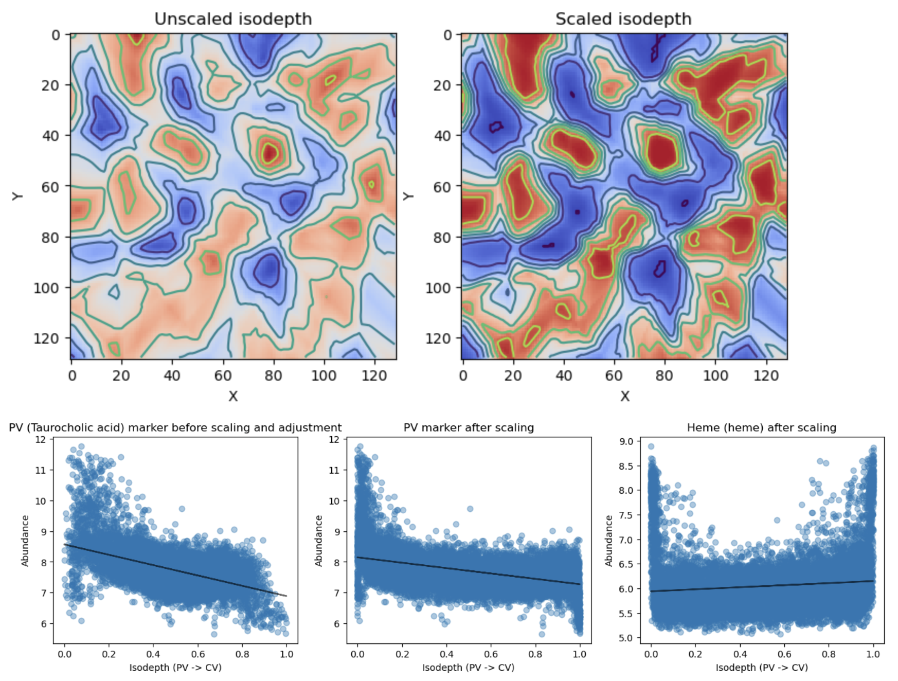
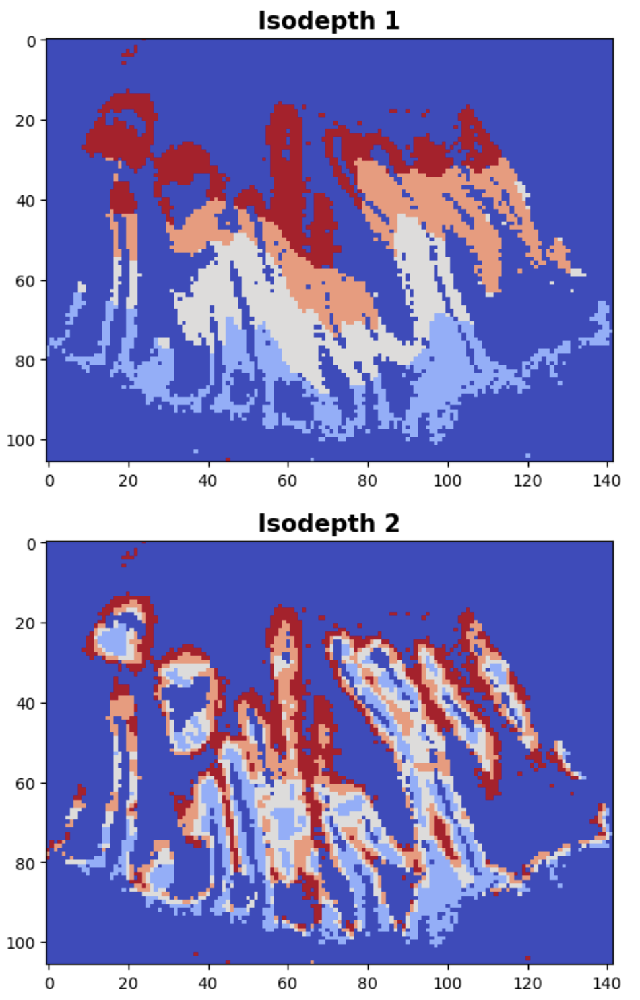

# MET-MAP
Reproducibility repository for Multi-GASTON applied on spatial metabolomics data.

This repository provides two jupyter notebook tutorials on applying the deep learning model _Multi-GASTON_—-referred to here as _Metabolic Topography Mapper: MET-MAP_-—to spatial metabolomics data from murine liver and small intestine. To support reproducibility, we include example datasets, neural network outputs, and downstream metabolite analyses. Although these tutorials focus on metabolomics, MET-MAP is broadly applicable to any spatially-resolved data, enabling the recovery of tissue architecture and spatial patterns of feature variation across diverse organs. For more details about the model, please visit: https://github.com/raphael-group/Multi-GASTON/tree/main.

<p align="center">


</p>

## Installation
For enviroment setup, please refer to Multi-GASTON installation at https://github.com/raphael-group/Multi-GASTON/tree/main. After installing Multi-GASTON package, simply activate the conda enviroment required for the jupyter notebooks.
```
conda activate multi_gaston_env
```
