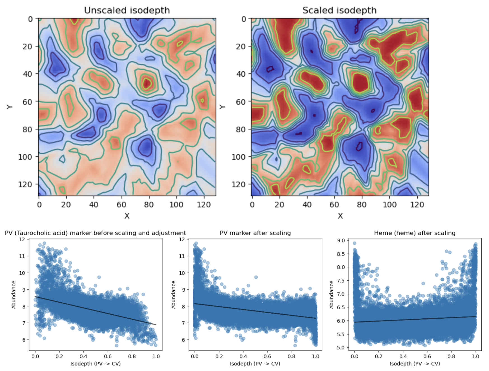
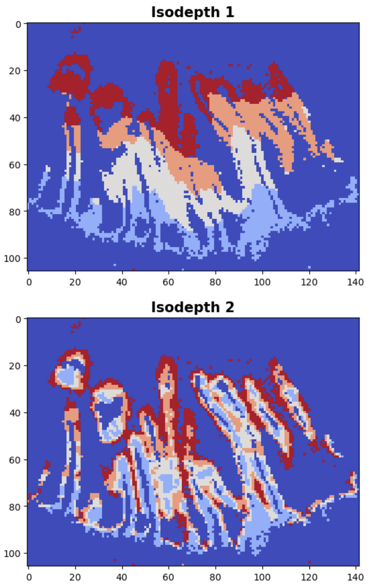
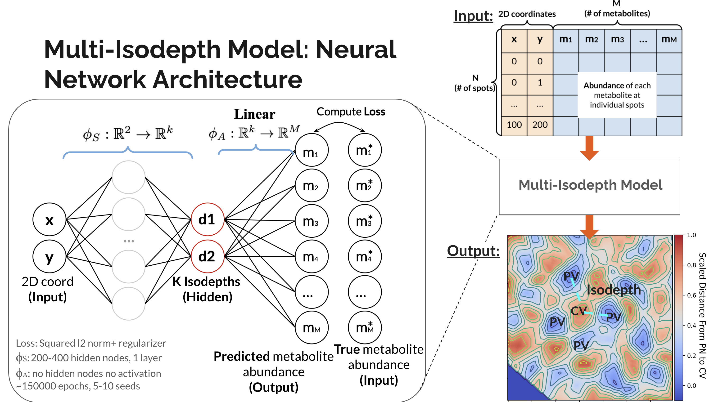

# MET-MAP (Metabolic Topography Mapper)
<!-- **Reproducibility repository for Multi-GASTON applied on spatial metabolomics data.** -->

This repository provides the source code and Jupyter notebook tutorials for applying **MET-MAP**—a deep learning model that recovers tissue architecture and spatial patterns of feature variation—to spatial metabolomics data from murine liver and small intestine. 
<p align="center">


</p>

---

> [!IMPORTANT]
> **Version Note:** MET-MAP and the source code contained in this repository is a **preliminary implementation** of some of the ideas that are now part of **Multi-GASTON**. This implementation was used specifically for the analyses in our 2025 *Nature* publication. 
> 
> For the **current and actively maintained** model, which enables simoutaneous learning from _multiple samples_ with _non-linear_ feature functions, please refer to [Multi-GASTON repository](https://github.com/raphael-group/Multi-GASTON).

---

## Overview

MET-MAP is an unsupervised deep learning model that learns multiple spatial gradients simoutaineously from spatial metabolomics data. It is an extension of GASTON (https://pmc.ncbi.nlm.nih.gov/articles/PMC10592770/), which was designed for spatially-resolved transcriptomics(SRT) data and learns a single topographic map of a 2-D tissue slice in terms of a 1-D coordinate called _isodepth_, where all genes can be expressed as a function of this isodepth. Now, allowing features like metabolites to be expressed as **linear*** functions of _mulitple distinct spatial patterns_, MET-MAP captures the feature topography by learning _k isodepths_, that smoothly vary across a tissue slice and capture spatial organizations of different groups of spatially variable features. 
<p align="center">

</p>

To support reproducibility, this repository now includes:
* **Original MET-MAP Source Code**
* **Example datasets**
* **Neural network outputs**
* **Downstream metabolite analyses**

## Installation
   ```bash
   git clone https://github.com/raphael-group/MET-MAP.git
   cd MET-MAP
   ```
   
## Data availability
For liver and small intestine metabolomics data used in the paper, please refer to Figshare repositories:

* Liver spatial metabolomics: https://doi.org/10.6084/m9.figshare.29318279.v1

* Intestine spatial metabolomics: https://doi.org/10.6084/m9.figshare.29318342.v1

## Citation

Please cite our manuscript published at Nature if you use our method:

Samarah, L.Z., Zheng, C., Xing, X. et al. Spatial metabolic gradients in the liver and small intestine. Nature (2025). https://doi.org/10.1038/s41586-025-09616-5.
```
@article{cite-key,
	Author = {Samarah, Laith Z. and Zheng, Clover and Xing, Xi and Lee, Won Dong and Afriat, Amichay and Chitra, Uthsav and MacArthur, Michael R. and Lu, Wenyun and Jankowski, Connor S. R. and Ma, Cong and Hunter, Craig J. and Neinast, Michael and Weilandt, Daniel R. and Raphael, Benjamin J. and Rabinowitz, Joshua D.},
	Journal = {Nature},
	Number = {8092},
	Pages = {182--190},
	Title = {Spatial metabolic gradients in the liver and small intestine},
	Volume = {648},
	Year = {2025}}
```
